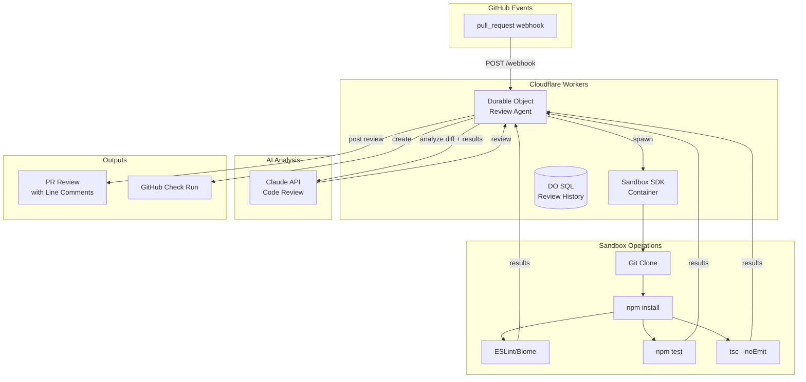
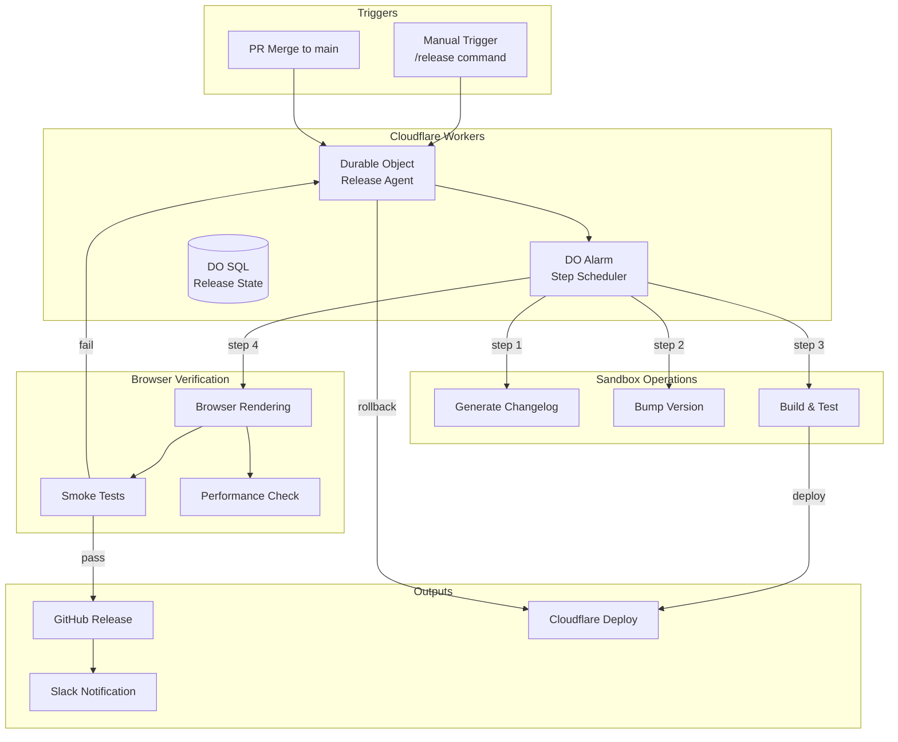
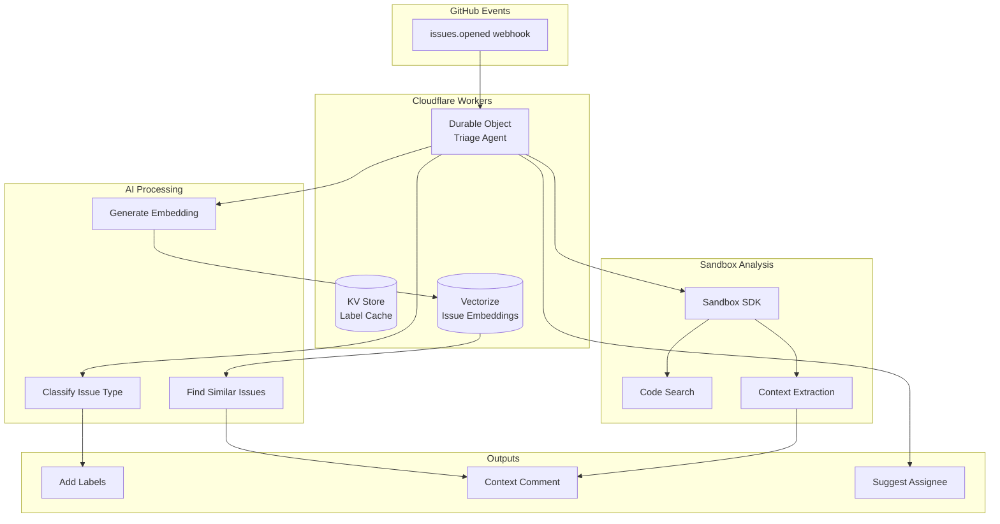
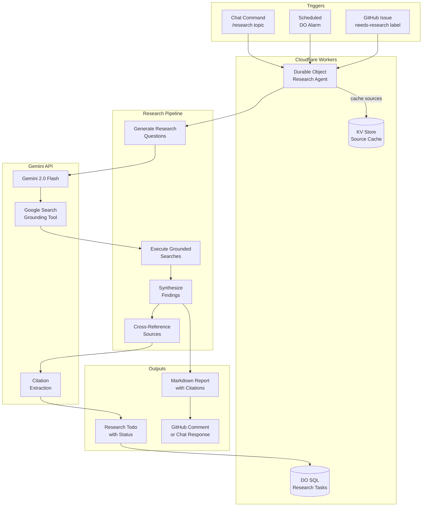

# Agents Improvement Proposals

Analysis of potential libraries, design patterns, and workflows to enhance the Cloudflare Agents service.

---

## 1. Library Additions

### 1.1 Schema Validation: Zod (Already Installed)

**Current Status**: Imported but underutilized

**Proposal**: Add runtime validation for all external data

```typescript
// Example: GitHub API response validation
const GitHubPRSchema = z.object({
  number: z.number(),
  title: z.string(),
  state: z.enum(['open', 'closed']),
  head: z.object({
    ref: z.string(),
    sha: z.string(),
  }),
  draft: z.boolean(),
});

// Usage in GitHubAgent
const prs = GitHubPRSchema.array().parse(await response.json());
```

| Pros | Cons |
|------|------|
| Already installed (zero bundle cost) | Adds validation overhead |
| Type-safe runtime validation | Need to maintain schemas alongside types |
| Better error messages for malformed data | |
| Can generate TypeScript types from schemas | |

**Recommendation**: ✅ Implement - Low effort, high value

---

### 1.2 HTTP Client: `ky` or `ofetch`

**Current Status**: Using raw `fetch()` with manual error handling

**Proposal**: Lightweight HTTP client with built-in retries

```typescript
// With ky
import ky from 'ky';

const github = ky.create({
  prefixUrl: 'https://api.github.com',
  headers: { Authorization: `Bearer ${token}` },
  retry: { limit: 3, methods: ['get'] },
  timeout: 10000,
});

const prs = await github.get('repos/owner/repo/pulls').json();
```

| Library | Size | Pros | Cons |
|---------|------|------|------|
| **ky** | 3.5KB | Retry logic, timeout, hooks, widely used | Another dependency |
| **ofetch** | 2KB | Smaller, auto-retry, JSON parsing | Less mature |
| **Native fetch** | 0KB | No dependency | Manual retry/timeout logic |

**Recommendation**: ⚠️ Consider - Current manual approach works, but error-prone

---

### 1.3 Rate Limiting: `bottleneck` or `p-limit`

**Current Status**: No rate limiting for GitHub API calls

**Proposal**: Add rate limiter for external API calls

```typescript
import Bottleneck from 'bottleneck';

const limiter = new Bottleneck({
  maxConcurrent: 1,
  minTime: 100, // 10 requests/second max
});

// Wrap all GitHub API calls
const fetchPRs = limiter.wrap(async () => {
  return fetch('https://api.github.com/repos/.../pulls');
});
```

| Library | Pros | Cons |
|---------|------|------|
| **bottleneck** | Clustering, persistence, queuing | Heavier (15KB) |
| **p-limit** | Simple, tiny (1KB) | No persistence |
| **Custom** | Cloudflare-native (Durable Objects) | More code to maintain |

**Recommendation**: ⚠️ Defer - Build custom with Durable Objects for persistence

---

### 1.4 Cron Parsing: `cron-parser`

**Current Status**: Manual cron validation (splits by space, checks 5 parts)

**Proposal**: Proper cron expression parsing and next-run calculation

```typescript
import parser from 'cron-parser';

const interval = parser.parseExpression('*/5 * * * *');
const nextRun = interval.next().toDate();
const prevRun = interval.prev().toDate();
```

| Pros | Cons |
|------|------|
| Accurate next/prev run calculation | 8KB dependency |
| Handles edge cases (leap years, DST) | May be overkill for simple crons |
| Good for debugging scheduled tasks | |

**Recommendation**: ✅ Implement - Useful for dashboard/debugging

---

### 1.5 Observability: `@opentelemetry/api`

**Current Status**: Logs to SQLite only, no external observability

**Proposal**: Add OpenTelemetry for distributed tracing

```typescript
import { trace, SpanStatusCode } from '@opentelemetry/api';

const tracer = trace.getTracer('agents');

async function executeTask(task: Task) {
  return tracer.startActiveSpan('task.execute', async (span) => {
    span.setAttribute('task.id', task.id);
    span.setAttribute('task.type', task.name);
    try {
      const result = await doWork();
      span.setStatus({ code: SpanStatusCode.OK });
      return result;
    } catch (error) {
      span.setStatus({ code: SpanStatusCode.ERROR, message: error.message });
      throw error;
    } finally {
      span.end();
    }
  });
}
```

| Pros | Cons |
|------|------|
| Industry standard | Larger bundle (~20KB) |
| Works with any backend (Datadog, Jaeger, etc.) | Requires collector setup |
| Distributed tracing across agents | Cloudflare Workers limitations |
| Built-in metrics support | |

**Recommendation**: ⚠️ Defer - Good for scale, but adds complexity. Start with Cloudflare's built-in analytics.

---

### 1.6 Testing: `@cloudflare/vitest-pool-workers`

**Current Status**: Using `unstable_dev` from wrangler (flaky)

**Proposal**: Official Cloudflare Vitest pool for Workers testing

```typescript
// vitest.config.ts
import { defineWorkersConfig } from '@cloudflare/vitest-pool-workers/config';

export default defineWorkersConfig({
  test: {
    poolOptions: {
      workers: {
        wrangler: { configPath: './wrangler.toml' },
      },
    },
  },
});
```

| Pros | Cons |
|------|------|
| Official Cloudflare support | Newer, less documentation |
| Better Durable Objects testing | May require test restructuring |
| No `unstable_dev` flakiness | |
| Proper module resolution | |

**Recommendation**: ✅ Implement - More reliable integration tests

---

## 2. Design Patterns

### 2.1 Circuit Breaker Pattern

**Current Gap**: No protection against cascading failures

**Proposal**: Implement circuit breaker for external APIs

```typescript
class CircuitBreaker {
  private failures = 0;
  private lastFailure?: number;
  private state: 'closed' | 'open' | 'half-open' = 'closed';

  constructor(
    private threshold: number = 5,
    private resetTimeout: number = 30000
  ) {}

  async execute<T>(fn: () => Promise<T>): Promise<T> {
    if (this.state === 'open') {
      if (Date.now() - this.lastFailure! > this.resetTimeout) {
        this.state = 'half-open';
      } else {
        throw new Error('Circuit breaker is open');
      }
    }

    try {
      const result = await fn();
      this.onSuccess();
      return result;
    } catch (error) {
      this.onFailure();
      throw error;
    }
  }
}
```

| Pros | Cons |
|------|------|
| Prevents cascade failures | More complex error handling |
| Fast-fail for known-bad services | State management complexity |
| Self-healing (half-open state) | May hide transient issues |

**Recommendation**: ✅ Implement for GitHub API calls

---

### 2.2 Event Sourcing (Light)

**Current**: Direct state updates via SQL

**Proposal**: Log all state changes as events

```typescript
interface AgentEvent {
  id: string;
  timestamp: number;
  type: 'task.created' | 'task.started' | 'task.completed' | 'alert.raised';
  payload: unknown;
  agentId: string;
}

// Store events, derive state
class EventStore {
  append(event: AgentEvent): void {
    this.sql.exec(`INSERT INTO events ...`);
  }

  replay(fromTimestamp?: number): AgentEvent[] {
    return this.sql.exec(`SELECT * FROM events WHERE timestamp > ?`);
  }
}
```

| Pros | Cons |
|------|------|
| Full audit trail | More storage |
| Time-travel debugging | Query complexity |
| Event replay for recovery | Learning curve |

**Recommendation**: ⚠️ Partial - Already have task history, add for alerts/pipelines

---

### 2.3 Saga Pattern for Pipelines

**Current**: Sequential step execution, no compensation

**Proposal**: Add rollback/compensation for failed pipelines

```typescript
interface PipelineStep {
  id: string;
  execute: (context: PipelineContext) => Promise<StepResult>;
  compensate?: (context: PipelineContext) => Promise<void>; // Rollback
}

async function runPipelineWithSaga(pipeline: Pipeline): Promise<void> {
  const completed: PipelineStep[] = [];

  for (const step of pipeline.steps) {
    try {
      await step.execute(context);
      completed.push(step);
    } catch (error) {
      // Rollback in reverse order
      for (const completedStep of completed.reverse()) {
        await completedStep.compensate?.(context);
      }
      throw error;
    }
  }
}
```

| Pros | Cons |
|------|------|
| Graceful failure handling | Not all operations are reversible |
| Consistent state after failures | More complex pipeline definitions |
| Better for multi-agent workflows | |

**Recommendation**: ⚠️ Consider - Useful for content/deployment pipelines

---

### 2.4 Command Query Responsibility Segregation (CQRS)

**Current**: Same methods for reads and writes

**Proposal**: Separate read/write paths

```typescript
// Commands (writes)
class TaskCommandHandler {
  async createTask(cmd: CreateTaskCommand): Promise<string> { ... }
  async cancelTask(cmd: CancelTaskCommand): Promise<void> { ... }
}

// Queries (reads)
class TaskQueryHandler {
  async getTask(id: string): Promise<Task> { ... }
  async listTasks(filter: TaskFilter): Promise<Task[]> { ... }
}
```

| Pros | Cons |
|------|------|
| Clearer code organization | Over-engineering for simple cases |
| Optimize reads/writes separately | More boilerplate |
| Better for complex queries | |

**Recommendation**: ❌ Skip - Current scale doesn't warrant this complexity

---

### 2.5 Plugin Architecture

**Current**: Hardcoded agent types and tools

**Proposal**: Dynamic agent/tool registration

```typescript
interface AgentPlugin {
  name: string;
  version: string;
  tools: ToolDefinition[];
  initialize(env: Env): Promise<void>;
}

class PluginRegistry {
  private plugins = new Map<string, AgentPlugin>();

  register(plugin: AgentPlugin): void {
    this.plugins.set(plugin.name, plugin);
  }

  async executeToolFromPlugin(pluginName: string, toolName: string, params: unknown) {
    const plugin = this.plugins.get(pluginName);
    const tool = plugin?.tools.find(t => t.name === toolName);
    return tool?.execute(params);
  }
}
```

| Pros | Cons |
|------|------|
| Extensible without core changes | Dynamic loading complexity |
| Third-party integrations | Security considerations |
| Version management | Testing complexity |

**Recommendation**: ⚠️ Future - Good for extensibility, not needed yet

---

## 3. Additional Workflows

### 3.1 PR Preview Integration Workflow

**Purpose**: Notify agents when PR previews are deployed

```yaml
# .github/workflows/preview-notify-agents.yml
name: Notify Agents of Preview

on:
  deployment_status:
    types: [success]

jobs:
  notify-agents:
    if: github.event.deployment_status.state == 'success'
    runs-on: ubuntu-latest
    steps:
      - name: Notify Agents Worker
        run: |
          curl -X POST "${{ secrets.AGENTS_URL }}/agents/github/tasks" \
            -H "Content-Type: application/json" \
            -d '{
              "name": "trackDeployment",
              "payload": {
                "prNumber": "${{ github.event.deployment.payload.pr_number }}",
                "environment": "${{ github.event.deployment.environment }}",
                "url": "${{ github.event.deployment_status.target_url }}"
              }
            }'
```

| Pros | Cons |
|------|------|
| Real-time deployment tracking | Requires AGENTS_URL secret |
| Better PR ↔ Deployment mapping | Additional workflow |
| Webhook-like behavior | |

---

### 3.2 Scheduled Health Report Workflow

**Purpose**: Generate and post weekly health reports

```yaml
# .github/workflows/weekly-health-report.yml
name: Weekly Health Report

on:
  schedule:
    - cron: '0 9 * * 1'  # Every Monday at 9 AM UTC

jobs:
  report:
    runs-on: ubuntu-latest
    steps:
      - name: Fetch Health Report
        id: health
        run: |
          REPORT=$(curl -s "${{ secrets.AGENTS_URL }}/agents/health/report?hours=168")
          echo "report=$REPORT" >> $GITHUB_OUTPUT

      - name: Create Issue if Score Low
        if: fromJSON(steps.health.outputs.report).healthScore < 90
        uses: actions/github-script@v7
        with:
          script: |
            const report = ${{ steps.health.outputs.report }};
            await github.rest.issues.create({
              owner: context.repo.owner,
              repo: context.repo.repo,
              title: `⚠️ Weekly Health Report: Score ${report.healthScore}%`,
              body: `## Health Report\n\n- Score: ${report.healthScore}%\n- Checks: ${report.totalChecks}\n- Failures: ${report.failures}`,
              labels: ['health', 'automated']
            });
```

| Pros | Cons |
|------|------|
| Visibility into system health | GitHub API calls |
| Automated issue creation | May create noise |
| Historical tracking via issues | |

---

### 3.3 Dependency Update Workflow

**Purpose**: Track when dependencies are updated

```yaml
# .github/workflows/dependency-notify.yml
name: Dependency Update Notification

on:
  push:
    paths:
      - 'package.json'
      - 'package-lock.json'

jobs:
  notify:
    runs-on: ubuntu-latest
    steps:
      - uses: actions/checkout@v4
        with:
          fetch-depth: 2

      - name: Detect Changes
        id: deps
        run: |
          CHANGES=$(git diff HEAD~1 package.json | grep '"version"' || echo "")
          echo "changes=$CHANGES" >> $GITHUB_OUTPUT

      - name: Notify Agents
        if: steps.deps.outputs.changes != ''
        run: |
          curl -X POST "${{ secrets.AGENTS_URL }}/agents/content/tasks" \
            -H "Content-Type: application/json" \
            -d '{"name": "trackDependencyUpdate", "payload": {}}'
```

---

### 3.4 Manual Agent Trigger Workflow

**Purpose**: Manually trigger agent tasks via GitHub Actions

```yaml
# .github/workflows/trigger-agent.yml
name: Trigger Agent Task

on:
  workflow_dispatch:
    inputs:
      agent:
        description: 'Agent type'
        required: true
        type: choice
        options: [health, github, content, orchestrator]
      task:
        description: 'Task name'
        required: true
        type: string
      payload:
        description: 'JSON payload'
        required: false
        default: '{}'

jobs:
  trigger:
    runs-on: ubuntu-latest
    steps:
      - name: Trigger Task
        run: |
          curl -X POST "${{ secrets.AGENTS_URL }}/agents/${{ inputs.agent }}/tasks" \
            -H "Content-Type: application/json" \
            -d '{
              "name": "${{ inputs.task }}",
              "payload": ${{ inputs.payload }}
            }'
```

| Pros | Cons |
|------|------|
| Manual intervention capability | Requires AGENTS_URL secret |
| Good for debugging | Could be misused |
| No direct Cloudflare access needed | |

---

### 3.5 Stale PR Cleanup Workflow

**Purpose**: Auto-close stale PRs and notify agents

```yaml
# .github/workflows/stale-pr-cleanup.yml
name: Stale PR Cleanup

on:
  schedule:
    - cron: '0 0 * * 0'  # Weekly

jobs:
  stale:
    runs-on: ubuntu-latest
    steps:
      - uses: actions/stale@v9
        with:
          stale-pr-message: 'This PR has been inactive for 30 days.'
          days-before-stale: 30
          days-before-close: 7
          stale-pr-label: 'stale'

      - name: Refresh Agents Data
        run: |
          curl -X POST "${{ secrets.AGENTS_URL }}/agents/github/tasks" \
            -H "Content-Type: application/json" \
            -d '{"name": "refreshPRData", "payload": {}}'
```

---

## 4. Priority Matrix

| Item | Impact | Effort | Priority |
|------|--------|--------|----------|
| Zod validation | High | Low | **P1** |
| Circuit breaker | High | Medium | **P1** |
| `@cloudflare/vitest-pool-workers` | High | Medium | **P1** |
| Cron parser | Medium | Low | **P2** |
| Manual trigger workflow | Medium | Low | **P2** |
| Weekly health report | Medium | Low | **P2** |
| Saga pattern | Medium | High | **P3** |
| Event sourcing | Low | High | **P4** |
| OpenTelemetry | Low | High | **P4** |
| Plugin architecture | Low | High | **P4** |

---

## 5. Quick Wins (< 1 hour each)

1. **Add Zod schemas** for GitHub API responses
2. **Add `cron-parser`** for better schedule debugging
3. **Create manual trigger workflow** (`workflow_dispatch`)
4. **Add circuit breaker** class (standalone, ~50 lines)
5. **Create weekly health report** workflow

---

## 6. Recommended Implementation Order

### Phase 1: Reliability (Week 1)
- [ ] Implement circuit breaker for GitHub API
- [ ] Add Zod validation for external data
- [ ] Switch to `@cloudflare/vitest-pool-workers`

### Phase 2: Observability (Week 2)
- [ ] Add `cron-parser` for schedule debugging
- [ ] Create weekly health report workflow
- [ ] Add manual agent trigger workflow

### Phase 3: Workflows (Week 3)
- [ ] PR preview notification workflow
- [ ] Dependency update tracking
- [ ] Stale PR cleanup integration

### Phase 4: Advanced (Future)
- [ ] Saga pattern for pipelines
- [ ] Light event sourcing for audits
- [ ] OpenTelemetry integration

---

## 7. Long-Running Multi-Step Agents (Cloudflare-Native)

This section proposes advanced agents that leverage Cloudflare's native services for multi-step workflows. All proposals are specifically designed for Cloudflare Workers environment (no local filesystem or local process execution).

### 7.1 Cloudflare-Native Building Blocks

#### Cloudflare Sandbox SDK
**What it provides:**
- Container-based code execution environment
- Virtual filesystem with full read/write access
- Git clone operations (clone repos, checkout branches)
- Process management (npm install, npm test, etc.)
- Claude Code integration for AI-assisted code analysis

**Use cases:** Code review, automated testing, dependency analysis, code generation

#### Cloudflare Browser Rendering
**What it provides:**
- Headless Chrome on Cloudflare's edge
- Puppeteer/Playwright API via Workers binding
- Session persistence with Durable Objects
- Screenshots, PDFs, web scraping

**Use cases:** Visual regression testing, PR preview screenshots, accessibility audits

#### @cloudflare/playwright-mcp
**What it provides:**
- MCP server for browser automation
- Accessibility snapshot mode (faster, text-based)
- Screenshot mode for visual interactions
- Remote MCP server architecture (SSE/HTTP)

#### Cloudflare's Managed MCP Servers
Available servers:
- **Workers Bindings MCP** - KV, R2, D1, DO access
- **Observability MCP** - Logs, analytics, traces
- **Browser Rendering MCP** - Screenshot tools

---

### 7.2 Proposal A: PR Preview QA Agent (Recommended)

**Purpose:** Automatically validate PR preview deployments with visual regression, accessibility, and performance testing.

**Architecture:**

```mermaid
flowchart TB
    subgraph "GitHub Events"
        GH[deployment_status webhook]
    end

    subgraph "Cloudflare Workers"
        DO[Durable Object<br/>PR QA Agent]
        BROWSER[Browser Rendering API]
        R2[(R2 Storage<br/>Screenshots)]
        SQL[(DO SQL<br/>Test Results)]
    end

    subgraph "Browser Automation"
        PLAYWRIGHT[@cloudflare/playwright-mcp]
        A11Y[Accessibility Snapshots]
        PERF[Performance Metrics]
        VISUAL[Visual Regression]
    end

    subgraph "Outputs"
        PR_COMMENT[PR Comment<br/>with Report]
        DIFF_IMAGES[Visual Diff<br/>Images]
    end

    GH -->|POST /webhook| DO
    DO -->|spawn session| BROWSER
    BROWSER --> PLAYWRIGHT
    PLAYWRIGHT --> A11Y
    PLAYWRIGHT --> PERF
    PLAYWRIGHT --> VISUAL
    A11Y -->|store| SQL
    PERF -->|store| SQL
    VISUAL -->|baseline + diff| R2
    DO -->|post comment| PR_COMMENT
    R2 -->|serve| DIFF_IMAGES
```

**Workflow:**

1. **Trigger:** `deployment_status` webhook fires when PR preview deploys
2. **Browser Session:** Agent spawns Browser Rendering session via Durable Object
3. **Accessibility Audit:**
   - Navigate to preview URL
   - Generate accessibility snapshot via @cloudflare/playwright-mcp
   - Run axe-core checks
   - Store results in DO SQL
4. **Visual Regression:**
   - Capture screenshots of key pages/components
   - Compare against baseline (main branch) stored in R2
   - Generate visual diff images
   - Store new baseline if on main
5. **Performance Metrics:**
   - Capture Core Web Vitals (LCP, FID, CLS)
   - Compare against previous deployment
   - Flag regressions > 10%
6. **Report Generation:**
   - Compile results into markdown table
   - Include visual diff thumbnails (R2 URLs)
   - Post as PR comment via GitHub API

**Implementation:**

```typescript
// agents/src/agents/pr-qa-agent.ts
import { Agent, type Connection } from "@anthropic/agent-sdk";
import { DurableObject } from "cloudflare:workers";

interface PRQAState {
  prNumber: number;
  previewUrl: string;
  baselineUrl?: string;
  testResults: TestResult[];
  status: 'pending' | 'running' | 'completed' | 'failed';
}

export class PRQAAgent extends DurableObject<Env> {
  private browser?: BrowserSession;

  async runQA(previewUrl: string, prNumber: number): Promise<QAReport> {
    // 1. Initialize browser session
    this.browser = await this.env.BROWSER.open({
      // Session persists across requests via DO
      keep_alive: 600000, // 10 minutes
    });

    // 2. Run accessibility audit
    const a11yResults = await this.runAccessibilityAudit(previewUrl);

    // 3. Capture screenshots for visual regression
    const screenshots = await this.captureScreenshots(previewUrl);

    // 4. Compare with baseline
    const visualDiffs = await this.compareWithBaseline(screenshots);

    // 5. Capture performance metrics
    const perfMetrics = await this.capturePerformanceMetrics(previewUrl);

    // 6. Store results
    await this.storeResults(prNumber, { a11yResults, visualDiffs, perfMetrics });

    // 7. Generate and post report
    return this.generateReport(prNumber);
  }

  private async runAccessibilityAudit(url: string): Promise<A11yResult[]> {
    const page = await this.browser!.newPage();
    await page.goto(url, { waitUntil: 'networkidle' });

    // Use accessibility snapshot mode (faster than screenshots)
    const snapshot = await page.accessibility.snapshot();

    // Run axe-core
    await page.addScriptTag({ url: 'https://cdn.jsdelivr.net/npm/axe-core/axe.min.js' });
    const violations = await page.evaluate(() =>
      (window as any).axe.run()
    );

    return violations.violations;
  }

  private async captureScreenshots(url: string): Promise<Screenshot[]> {
    const pages = ['/', '/about', '/breathing'];
    const screenshots: Screenshot[] = [];

    for (const path of pages) {
      const page = await this.browser!.newPage();
      await page.goto(`${url}${path}`, { waitUntil: 'networkidle' });

      const buffer = await page.screenshot({ fullPage: true });

      // Store in R2
      const key = `screenshots/${Date.now()}/${path.replace('/', 'index')}.png`;
      await this.env.R2_BUCKET.put(key, buffer);

      screenshots.push({ path, key, url: `${this.env.R2_PUBLIC_URL}/${key}` });
    }

    return screenshots;
  }
}
```

**Pros:**
| Advantage | Detail |
|-----------|--------|
| True browser testing | Real Chrome, not jsdom simulation |
| Visual regression | Catches CSS/layout bugs humans miss |
| Accessibility built-in | WCAG compliance automation |
| Edge deployment | Fast globally, no cold starts |
| Persistent sessions | Durable Objects maintain browser state |
| No infrastructure | Fully serverless |

**Cons:**
| Disadvantage | Mitigation |
|--------------|------------|
| Browser session costs | Limit pages tested, cache aggressively |
| R2 storage for images | Lifecycle rules to delete old screenshots |
| Complex setup | Template/starter available |
| 10-minute max session | Chain multiple invocations |

**Recommendation:** ✅ **Strongly Recommended** - High value, moderate complexity

---

### 7.3 Proposal B: Sandbox Code Review Agent

**Purpose:** Clone PRs, run static analysis, execute tests, and provide AI-assisted code review with actual code execution.

**Architecture:**



**Workflow:**

1. **Trigger:** `pull_request.opened` or `pull_request.synchronize` webhook
2. **Sandbox Creation:** Spawn container with Sandbox SDK
3. **Repository Setup:**
   ```bash
   git clone --depth=1 --branch=pr-branch $REPO_URL
   cd repo && npm ci
   ```
4. **Static Analysis:**
   - Run ESLint/Biome with JSON output
   - Run TypeScript type checking
   - Collect all diagnostics
5. **Test Execution:**
   - Run `npm test` with coverage
   - Parse test results
   - Identify failing tests
6. **AI Code Review:**
   - Send PR diff + diagnostic results to Claude
   - Generate contextual review comments
   - Suggest fixes for common issues
7. **Post Results:**
   - Create GitHub Check Run with summary
   - Post line-level review comments
   - Update PR status

**Implementation:**

```typescript
// agents/src/agents/code-review-agent.ts
import { Sandbox } from "@anthropic/sandbox-sdk";

export class CodeReviewAgent extends DurableObject<Env> {
  async reviewPR(owner: string, repo: string, prNumber: number): Promise<ReviewResult> {
    // 1. Create sandbox container
    const sandbox = await Sandbox.create({
      template: "node-20", // Pre-configured Node.js environment
    });

    try {
      // 2. Clone PR branch
      const prData = await this.fetchPRData(owner, repo, prNumber);
      await sandbox.exec(`git clone --depth=1 --branch=${prData.head.ref} https://github.com/${owner}/${repo}.git repo`);
      await sandbox.exec("cd repo && npm ci");

      // 3. Run static analysis
      const lintResults = await sandbox.exec("cd repo && npm run lint -- --format=json", {
        returnOutput: true,
        ignoreExitCode: true, // Don't fail on lint errors
      });

      const typeResults = await sandbox.exec("cd repo && npm run typecheck 2>&1", {
        returnOutput: true,
        ignoreExitCode: true,
      });

      // 4. Run tests
      const testResults = await sandbox.exec("cd repo && npm test -- --json", {
        returnOutput: true,
        ignoreExitCode: true,
        timeout: 300000, // 5 minutes
      });

      // 5. Get PR diff
      const diff = await this.fetchPRDiff(owner, repo, prNumber);

      // 6. AI-assisted review
      const review = await this.generateAIReview({
        diff,
        lintResults: JSON.parse(lintResults.stdout),
        typeResults: typeResults.stdout,
        testResults: JSON.parse(testResults.stdout),
      });

      // 7. Post results
      await this.postReview(owner, repo, prNumber, review);

      return { success: true, review };
    } finally {
      // Always cleanup sandbox
      await sandbox.destroy();
    }
  }

  private async generateAIReview(context: ReviewContext): Promise<Review> {
    const response = await fetch("https://api.anthropic.com/v1/messages", {
      method: "POST",
      headers: {
        "Content-Type": "application/json",
        "x-api-key": this.env.ANTHROPIC_API_KEY,
        "anthropic-version": "2023-06-01",
      },
      body: JSON.stringify({
        model: "claude-sonnet-4-20250514",
        max_tokens: 4096,
        system: `You are a code reviewer. Analyze the PR diff and diagnostic results.
                 Provide specific, actionable feedback. Focus on:
                 1. Bugs and logic errors
                 2. Security vulnerabilities
                 3. Performance issues
                 4. Code style and maintainability
                 Format: JSON with 'summary' and 'comments' array with {path, line, body}`,
        messages: [{ role: "user", content: JSON.stringify(context) }],
      }),
    });

    return response.json();
  }
}
```

**Pros:**
| Advantage | Detail |
|-----------|--------|
| Real code execution | Actually runs tests, not just analysis |
| Full filesystem | Git clone, npm install, file manipulation |
| AI-powered insights | Claude analyzes actual output |
| Consistent environment | Container ensures reproducibility |
| No GitHub runner cost | Cloudflare handles compute |

**Cons:**
| Disadvantage | Mitigation |
|--------------|------------|
| Container spin-up time | Pre-warm with `template` option |
| 10-minute default timeout | Chain invocations for long tests |
| Storage limits | Clone specific paths, not full repo |
| Sandbox costs | Limit to PRs from trusted contributors |

**Recommendation:** ✅ **Recommended** - High complexity but unique value

---

### 7.4 Proposal C: Release Orchestration Agent

**Purpose:** Coordinate multi-step release process: changelog generation, version bumping, deployment verification, and rollback.

**Architecture:**



**State Machine:**

```typescript
type ReleaseState =
  | { status: 'pending'; triggeredBy: string }
  | { status: 'generating-changelog'; commits: string[] }
  | { status: 'bumping-version'; newVersion: string }
  | { status: 'building'; buildId: string }
  | { status: 'deploying'; deploymentId: string }
  | { status: 'verifying'; previewUrl: string }
  | { status: 'completed'; releaseUrl: string }
  | { status: 'rolled-back'; reason: string }
  | { status: 'failed'; error: string };
```

**Pros:**
| Advantage | Detail |
|-----------|--------|
| Atomic releases | All-or-nothing with rollback |
| Verification built-in | Browser tests production |
| Audit trail | Full state history in DO SQL |
| Self-healing | Auto-rollback on failure |

**Cons:**
| Disadvantage | Mitigation |
|--------------|------------|
| Complex state machine | Use established patterns (XState) |
| Multiple service deps | Graceful degradation |
| Long-running process | DO alarms for step scheduling |

**Recommendation:** ⚠️ **Consider** - High value for mature projects

---

### 7.5 Proposal D: Issue Triage & Context Agent

**Purpose:** Automatically analyze new issues, add relevant labels, suggest related issues/PRs, and provide codebase context.

**Architecture:**



**Pros:**
| Advantage | Detail |
|-----------|--------|
| Instant triage | Issues labeled in seconds |
| Duplicate detection | Vectorize finds similar issues |
| Context provision | Sandbox searches codebase |
| Reduces maintainer toil | Auto-assignment suggestions |

**Cons:**
| Disadvantage | Mitigation |
|--------------|------------|
| Vectorize costs | Limit to issue title + first 500 chars |
| AI misclassification | Add confidence scores, human override |
| Cold start for search | Cache common searches |

**Recommendation:** ⚠️ **Consider** - Good ROI for high-volume repos

---

### 7.6 Proposal E: Research Agent with Gemini Grounding

**Purpose:** Perform autonomous research tasks using Gemini 2.0 Flash with Google Search grounding, maintaining a persistent research todo list with findings, sources, and actionable summaries.

**Why Gemini for Research:**
- **Native Google Search grounding** - Real-time web search integrated at the model level
- **Automatic citation generation** - `groundingMetadata` includes search queries, web results, and citations
- **Cost-effective** - Flash models are ~10x cheaper than frontier models for high-volume research
- **Multi-query synthesis** - Model automatically generates and executes multiple search queries

**Architecture:**



**Research Todo List Schema:**

```typescript
interface ResearchTask {
  id: string;
  topic: string;
  status: 'pending' | 'researching' | 'synthesizing' | 'completed' | 'blocked';
  questions: ResearchQuestion[];
  findings: Finding[];
  sources: Source[];
  createdAt: number;
  updatedAt: number;
  requestedBy: string; // user, scheduled, github-issue
}

interface ResearchQuestion {
  id: string;
  question: string;
  status: 'pending' | 'answered' | 'needs-more-info';
  answer?: string;
  confidence: number; // 0-1
  sources: string[]; // source IDs
}

interface Finding {
  id: string;
  summary: string;
  details: string;
  relevance: 'high' | 'medium' | 'low';
  verifiedBy: string[]; // multiple source IDs for cross-reference
}

interface Source {
  id: string;
  url: string;
  title: string;
  snippet: string;
  retrievedAt: number;
  groundingChunks: GroundingChunk[]; // from Gemini API
}
```

**Workflow:**

1. **Task Creation:**
   - User triggers via chat (`/research <topic>`) or GitHub issue label
   - Agent breaks topic into specific research questions
   - Creates research todo with pending questions

2. **Grounded Research:**
   ```typescript
   const response = await gemini.generateContent({
     model: 'gemini-2.0-flash',
     contents: [{ role: 'user', parts: [{ text: question }] }],
     tools: [{ googleSearch: {} }], // Enable grounding
   });

   // Extract grounding metadata
   const { groundingMetadata } = response.candidates[0];
   const sources = groundingMetadata.groundingChunks.map(chunk => ({
     url: chunk.web.uri,
     title: chunk.web.title,
   }));
   ```

3. **Multi-Query Synthesis:**
   - For complex topics, generate 3-5 sub-questions
   - Execute parallel grounded searches
   - Cross-reference findings across sources
   - Flag contradictions for human review

4. **Progressive Updates:**
   - Update todo status as research progresses
   - Stream partial findings to chat/PR comment
   - Mark questions as "needs-more-info" if confidence low

5. **Report Generation:**
   - Compile findings into structured markdown
   - Include inline citations with source URLs
   - Add confidence indicators per finding
   - Generate executive summary

**Implementation:**

```typescript
// agents/src/agents/research-agent.ts
import { GoogleGenerativeAI } from '@google/genai';

interface ResearchConfig {
  maxQuestionsPerTopic: number;
  confidenceThreshold: number;
  maxSourcesPerQuestion: number;
}

export class ResearchAgent extends DurableObject<Env> {
  private gemini: GoogleGenerativeAI;
  private config: ResearchConfig = {
    maxQuestionsPerTopic: 5,
    confidenceThreshold: 0.7,
    maxSourcesPerQuestion: 5,
  };

  constructor(state: DurableObjectState, env: Env) {
    super(state, env);
    this.gemini = new GoogleGenerativeAI(env.GEMINI_API_KEY);
  }

  async createResearchTask(topic: string, requestedBy: string): Promise<ResearchTask> {
    // 1. Generate research questions using Claude (better at planning)
    const questions = await this.generateResearchQuestions(topic);

    // 2. Create task in DO SQL
    const task: ResearchTask = {
      id: crypto.randomUUID(),
      topic,
      status: 'pending',
      questions: questions.map(q => ({
        id: crypto.randomUUID(),
        question: q,
        status: 'pending',
        confidence: 0,
        sources: [],
      })),
      findings: [],
      sources: [],
      createdAt: Date.now(),
      updatedAt: Date.now(),
      requestedBy,
    };

    await this.saveTask(task);

    // 3. Schedule research execution
    await this.ctx.storage.setAlarm(Date.now() + 100); // Start immediately

    return task;
  }

  async alarm(): Promise<void> {
    const pendingTasks = await this.getPendingTasks();

    for (const task of pendingTasks) {
      await this.executeResearch(task);
    }
  }

  private async executeResearch(task: ResearchTask): Promise<void> {
    task.status = 'researching';
    await this.saveTask(task);

    // Process each question with Gemini grounding
    for (const question of task.questions.filter(q => q.status === 'pending')) {
      try {
        const result = await this.groundedSearch(question.question);

        question.answer = result.answer;
        question.confidence = result.confidence;
        question.sources = result.sources.map(s => s.id);
        question.status = result.confidence >= this.config.confidenceThreshold
          ? 'answered'
          : 'needs-more-info';

        // Add sources to task
        task.sources.push(...result.sources);

        await this.saveTask(task);
      } catch (error) {
        console.error(`Research failed for question: ${question.question}`, error);
        question.status = 'needs-more-info';
      }
    }

    // Synthesize findings
    task.status = 'synthesizing';
    await this.saveTask(task);

    task.findings = await this.synthesizeFindings(task);
    task.status = 'completed';
    task.updatedAt = Date.now();

    await this.saveTask(task);

    // Post results
    await this.postResults(task);
  }

  private async groundedSearch(question: string): Promise<GroundedResult> {
    const model = this.gemini.getGenerativeModel({
      model: 'gemini-2.0-flash-exp',
      tools: [{ googleSearch: {} }],
    });

    const result = await model.generateContent({
      contents: [{ role: 'user', parts: [{ text: question }] }],
    });

    const response = result.response;
    const groundingMetadata = response.candidates?.[0]?.groundingMetadata;

    // Extract sources from grounding chunks
    const sources: Source[] = (groundingMetadata?.groundingChunks || []).map(chunk => ({
      id: crypto.randomUUID(),
      url: chunk.web?.uri || '',
      title: chunk.web?.title || '',
      snippet: chunk.web?.snippet || '',
      retrievedAt: Date.now(),
      groundingChunks: [chunk],
    }));

    // Cache sources in KV for deduplication
    for (const source of sources) {
      await this.env.KV.put(`source:${source.url}`, JSON.stringify(source), {
        expirationTtl: 86400, // 24 hours
      });
    }

    return {
      answer: response.text(),
      confidence: this.calculateConfidence(groundingMetadata),
      sources,
    };
  }

  private calculateConfidence(metadata: GroundingMetadata | undefined): number {
    if (!metadata) return 0.3;

    const hasWebResults = (metadata.webSearchQueries?.length || 0) > 0;
    const sourceCount = metadata.groundingChunks?.length || 0;
    const hasSupport = metadata.groundingSupports?.length || 0;

    // Weighted confidence calculation
    let confidence = 0.5; // Base confidence for any response
    if (hasWebResults) confidence += 0.1;
    if (sourceCount >= 2) confidence += 0.15;
    if (sourceCount >= 4) confidence += 0.1;
    if (hasSupport > 0) confidence += 0.15;

    return Math.min(confidence, 1.0);
  }

  private async synthesizeFindings(task: ResearchTask): Promise<Finding[]> {
    // Use Claude for synthesis (better at reasoning)
    const response = await fetch('https://api.anthropic.com/v1/messages', {
      method: 'POST',
      headers: {
        'Content-Type': 'application/json',
        'x-api-key': this.env.ANTHROPIC_API_KEY,
        'anthropic-version': '2023-06-01',
      },
      body: JSON.stringify({
        model: 'claude-sonnet-4-20250514',
        max_tokens: 2048,
        system: `Synthesize research findings into clear, actionable insights.
                 Return JSON array of findings with: summary, details, relevance (high/medium/low).
                 Cross-reference information across multiple sources.
                 Flag any contradictions or areas needing clarification.`,
        messages: [{
          role: 'user',
          content: JSON.stringify({
            topic: task.topic,
            questions: task.questions,
            sources: task.sources,
          }),
        }],
      }),
    });

    const data = await response.json();
    return JSON.parse(data.content[0].text);
  }

  // API endpoints
  async getTaskStatus(taskId: string): Promise<ResearchTask | null> {
    return this.ctx.storage.get(`task:${taskId}`);
  }

  async getTodoList(): Promise<ResearchTask[]> {
    const tasks = await this.ctx.storage.list({ prefix: 'task:' });
    return Array.from(tasks.values()) as ResearchTask[];
  }
}
```

**Use Cases:**

| Scenario | Trigger | Output |
|----------|---------|--------|
| Technology evaluation | `/research "Compare Bun vs Node.js for Workers"` | Comparison report with benchmarks, sources |
| Dependency analysis | GitHub issue labeled `needs-research` | Comment with security advisories, alternatives |
| Competitive analysis | Scheduled weekly | Report on competitor features, pricing changes |
| Documentation gaps | PR comment asking "how does X work?" | Explanation with official docs, examples |
| Bug investigation | Issue with error message | Stack Overflow solutions, GitHub issues, workarounds |

**Pros:**
| Advantage | Detail |
|-----------|--------|
| Real-time information | Google Search grounding gets latest data |
| Auto-citations | Every claim linked to verifiable source |
| Cost-effective | Flash model ~$0.075/1M input tokens |
| Persistent state | DO SQL tracks research progress |
| Multi-model | Gemini for search, Claude for synthesis |
| Deduplication | KV caches sources across tasks |

**Cons:**
| Disadvantage | Mitigation |
|--------------|------------|
| Grounding costs | Rate limit queries, cache aggressively |
| Quality variance | Cross-reference multiple sources |
| API key management | Use Cloudflare secrets |
| Search bias | Add diverse source requirements |

**Recommendation:** ✅ **Recommended** - Unique capability, moderate complexity

---

### 7.7 Comparison Matrix

| Feature | PR Preview QA | Code Review | Release Orchestration | Issue Triage | Research Agent |
|---------|---------------|-------------|----------------------|--------------|----------------|
| **Cloudflare Services** |
| Browser Rendering | ✅ Primary | ❌ | ✅ Verification | ❌ | ❌ |
| Sandbox SDK | ❌ | ✅ Primary | ✅ Build/Version | ✅ Code Search | ❌ |
| Durable Objects | ✅ Session | ✅ State | ✅ State Machine | ✅ Cache | ✅ Todo State |
| R2 | ✅ Screenshots | ❌ | ❌ | ❌ | ❌ |
| KV | ❌ | ❌ | ❌ | ✅ Labels | ✅ Source Cache |
| Vectorize | ❌ | ❌ | ❌ | ✅ Embeddings | ❌ |
| **External APIs** |
| Claude API | ❌ | ✅ Review | ❌ | ✅ Classification | ✅ Synthesis |
| Gemini API | ❌ | ❌ | ❌ | ❌ | ✅ Grounded Search |
| GitHub API | ✅ Comments | ✅ Reviews | ✅ Releases | ✅ Labels | ✅ Comments |
| **Complexity** |
| Setup Effort | Medium | High | High | Medium | Medium |
| Maintenance | Low | Medium | Medium | Low | Low |
| **Value** |
| Bug Prevention | High | High | Medium | Low | Low |
| Developer Experience | High | High | Medium | High | High |
| Knowledge Generation | Low | Low | Low | Medium | High |
| Automation Level | Full | Full | Full | Partial | Partial |
| **Cost Estimate** |
| Monthly (small project) | $5-15 | $10-30 | $5-10 | $5-15 | $5-20 |
| Monthly (large project) | $30-100 | $50-200 | $20-50 | $20-50 | $20-80 |

---

### 7.8 Recommended Implementation Order

**Phase 1: PR Preview QA Agent (Week 1-2)**
- [ ] Set up Browser Rendering binding
- [ ] Implement basic screenshot capture
- [ ] Add accessibility audit (axe-core)
- [ ] Create PR comment posting
- [ ] Add visual diff with R2 storage

**Phase 2: Code Review Agent (Week 3-4)**
- [ ] Set up Sandbox SDK binding
- [ ] Implement git clone workflow
- [ ] Add lint/typecheck execution
- [ ] Integrate Claude for review generation
- [ ] Create GitHub Check Run integration

**Phase 3: Research Agent (Week 5)**
- [ ] Set up Gemini API with grounding
- [ ] Implement research todo schema in DO SQL
- [ ] Create question generation pipeline
- [ ] Add source caching in KV
- [ ] Build synthesis with Claude

**Phase 4: Issue Triage (Week 6)**
- [ ] Set up Vectorize binding
- [ ] Create issue embedding pipeline
- [ ] Implement similarity search
- [ ] Add auto-labeling logic

**Phase 5: Release Orchestration (Week 7+)**
- [ ] Design state machine
- [ ] Implement changelog generation
- [ ] Add deployment verification
- [ ] Create rollback mechanism

---

### 7.9 Quick Start: PR Preview QA Agent

Minimal implementation to get started:

```typescript
// wrangler.toml additions
[browser]
binding = "BROWSER"

[[r2_buckets]]
binding = "SCREENSHOTS"
bucket_name = "pr-screenshots"

// agents/src/index.ts
export default {
  async fetch(request: Request, env: Env) {
    if (request.method === "POST" && new URL(request.url).pathname === "/webhook/deployment") {
      const { deployment_status } = await request.json();

      if (deployment_status.state === "success") {
        const stub = env.PR_QA.get(env.PR_QA.idFromName(`pr-${deployment_status.deployment.payload.pr_number}`));
        await stub.runQA(deployment_status.target_url, deployment_status.deployment.payload.pr_number);
      }
    }
    return new Response("OK");
  }
};

export { PRQAAgent } from "./agents/pr-qa-agent";
```

This provides a foundation for the most impactful agent while using Cloudflare-native services throughout.

---

## 8. Validation & Current API Status (January 2026)

### 8.1 Cloudflare Sandbox SDK

| Aspect | Status | Notes |
|--------|--------|-------|
| **Availability** | Beta | SDK is in active development, not GA |
| **Latest Update** | August 2025 | Major release with streaming, Git, process control |
| **Container Support** | Available | Announced June 2025, shipped with Sandbox SDK |
| **Stability** | Experimental | Cloudflare notes it's "exploring how isolated workloads scale" |

**Key Features Confirmed:**
- ✅ Live streaming of output
- ✅ Persistent Python/JavaScript interpreters
- ✅ File system access
- ✅ Git operations (clone, checkout)
- ✅ Background process control
- ✅ Public URL exposure for running services

**Recommendation:** Use for Code Review Agent but note beta status in error handling. Add fallback for sandbox unavailability.

**Sources:**
- [Sandbox SDK Docs](https://developers.cloudflare.com/sandbox/)
- [August 2025 Major Update](https://developers.cloudflare.com/changelog/2025-08-05-sandbox-sdk-major-update/)

---

### 8.2 Browser Rendering + Playwright MCP

| Aspect | Status | Notes |
|--------|--------|-------|
| **Availability** | GA | Billing started August 20, 2025 |
| **Playwright MCP Version** | v0.0.5 | Synced with upstream v0.0.30 |
| **Playwright Version** | v1.54.1 | Latest as of January 2026 |
| **Local Dev Support** | ✅ Yes | Works with `npx wrangler dev` |

**Accessibility Snapshot Mode (Recommended for PR QA Agent):**
- Fast and lightweight - uses Playwright's accessibility tree
- LLM-friendly - no vision models required
- Deterministic - avoids screenshot ambiguity
- Better for automated testing than screenshot mode

**Sources:**
- [Playwright MCP Docs](https://developers.cloudflare.com/browser-rendering/playwright/playwright-mcp/)
- [cloudflare/playwright-mcp GitHub](https://github.com/cloudflare/playwright-mcp)

---

### 8.3 Gemini 2.0 Flash Grounding

| Aspect | Details |
|--------|---------|
| **Free Tier** | 500 RPD (free tier) / 1,500 RPD (paid tier) |
| **Paid Pricing** | $35 per 1,000 grounded queries |
| **Token Pricing** | $0.10 / $0.40 per million (input/output) |
| **API Tool** | `googleSearch` tool (replaces `google_search_retrieval`) |

**Cost Estimate for Research Agent:**

| Usage Level | Monthly Queries | Grounding Cost | Token Cost | Total |
|-------------|-----------------|----------------|------------|-------|
| Light | 500/day | Free | ~$5 | ~$5 |
| Moderate | 1,500/day | Free | ~$15 | ~$15 |
| Heavy | 3,000/day | ~$52.50 | ~$30 | ~$82.50 |

**Note:** December 2025 quota changes may affect rate limits. Monitor for 429 errors.

**Sources:**
- [Gemini API Pricing](https://ai.google.dev/gemini-api/docs/pricing)
- [Grounding with Google Search](https://ai.google.dev/gemini-api/docs/google-search)

---

## 9. Architecture Simplification Opportunities

Analysis of the current agents codebase (~6,700 lines) reveals significant opportunities for consolidation and improved patterns.

### 9.1 Current Issues Summary

| Issue | Impact | Lines Affected |
|-------|--------|----------------|
| Duplicated task dispatcher pattern | 4x copy-paste | ~100 lines |
| GitHubAgent doesn't use GitHubService | Duplicate fetch logic, no circuit breaker | ~150 lines |
| Config scattered across agents | Hard to maintain | ~50 lines |
| Switch statement anti-pattern | Hard to test, extend | All agents |
| SQL scattered throughout | No type safety, hard to maintain | ~200 lines |

### 9.2 Proposed Architecture Improvements

#### 9.2.1 Extract BaseTaskAgent (HIGH Priority)

**Current hierarchy:**
```
BaseAgent (560 lines)
  ↓
[GitHubAgent, HealthAgent, ContentAgent, OrchestratorAgent]
 (682)        (464)        (392)          (401)
```

**Proposed hierarchy:**
```
BaseAgent (560 lines)
  ↓
BaseTaskAgent (new, ~150 lines)
  - Task handler registry
  - executeTask() with timing
  - Route registration
  ↓
[SpecializedAgents] (reduced to ~300 lines each)
```

**Implementation:**

```typescript
// agents/src/core/base-task-agent.ts
import { BaseAgent } from './base-agent';

type TaskHandler<P = unknown> = (payload: P, startTime: number) => Promise<TaskResult>;

export abstract class BaseTaskAgent extends BaseAgent {
  private taskHandlers = new Map<string, TaskHandler>();
  private routeHandlers = new Map<string, () => Response | Promise<Response>>();

  protected registerTask<P>(name: string, handler: TaskHandler<P>): void {
    this.taskHandlers.set(name, handler as TaskHandler);
  }

  protected registerRoute(method: string, path: string, handler: () => Response | Promise<Response>): void {
    this.routeHandlers.set(`${method} ${path}`, handler);
  }

  protected async executeTask(task: Task): Promise<TaskResult> {
    const startTime = Date.now();
    const handler = this.taskHandlers.get(task.name);

    if (!handler) {
      return this.errorResult(`Unknown task: ${task.name}`, startTime);
    }

    try {
      return await handler(task.payload, startTime);
    } catch (error) {
      return this.errorResult(error instanceof Error ? error.message : String(error), startTime);
    }
  }

  protected handleCustomRoute(request: Request, path: string): Response | Promise<Response> {
    const handler = this.routeHandlers.get(`${request.method} ${path}`);
    return handler?.() ?? this.jsonResponse({ error: 'Not found' }, 404);
  }

  protected successResult<T>(data: T, startTime: number): TaskResult {
    return { success: true, data, duration: Date.now() - startTime };
  }

  protected errorResult(error: string, startTime: number): TaskResult {
    return { success: false, error, duration: Date.now() - startTime };
  }
}
```

**Refactored GitHubAgent (example):**

```typescript
// agents/src/agents/github/index.ts (reduced from 682 to ~350 lines)
export class GitHubAgent extends BaseTaskAgent {
  private github!: GitHubService;

  protected async initializeSchema(): Promise<void> {
    await super.initializeSchema();
    // Schema initialization...

    // Initialize service
    this.github = createGitHubService(this.env);

    // Register task handlers (replaces switch statement)
    this.registerTask('fetchOpenPRs', (_, start) => this.fetchOpenPRs(start));
    this.registerTask('fetchPRDeployments', (p, start) => this.fetchPRDeployments(p, start));
    this.registerTask('refreshPRData', (_, start) => this.refreshPRData(start));

    // Register routes (replaces if/else chain)
    this.registerRoute('GET', '/prs', () => this.getPRsWithDeployments());
    this.registerRoute('GET', '/deployments', () => this.getDeployments());
    this.registerRoute('POST', '/prs/refresh', () => this.triggerPRRefresh());
  }

  private async fetchOpenPRs(startTime: number): Promise<TaskResult> {
    const prs = await this.github.getOpenPRs(); // Uses GitHubService with circuit breaker
    // Store in SQL...
    return this.successResult({ count: prs.length }, startTime);
  }
}
```

---

#### 9.2.2 Integrate GitHubService into GitHubAgent (HIGH Priority)

**Current duplication:**
- `GitHubAgent.fetchGitHub<T>()` - raw fetch, no protection
- `GitHubService.validatedGet<T>()` - circuit breaker, rate limiting, Zod validation

**Migration steps:**

1. Add GitHubService instance to GitHubAgent
2. Replace `fetchGitHub()` calls with `github.getOpenPRs()` etc.
3. Remove duplicate type definitions
4. Delete `fetchGitHub()` and `getApiConfig()` methods

**Benefits:**
- Circuit breaker protects against GitHub API outages
- Rate limiting prevents 429 errors
- Zod validation catches malformed responses
- Single source of truth for GitHub API logic

---

#### 9.2.3 Centralize Configuration (MEDIUM Priority)

**Current state:**
```typescript
// HealthAgent (lines 20-29)
const ENDPOINTS = ['https://api1...', 'https://api2...'];
const LATENCY_THRESHOLDS = { warning: 1000, critical: 5000 };

// ContentAgent (lines 21-26)
const CONTENT_CONFIG = { maxRetention: 30, ... };
```

**Proposed structure:**
```
agents/src/config/
├── endpoints.ts      # Health check endpoints + pipelines
├── thresholds.ts     # Latency, retention thresholds
├── content.ts        # Content agent config
└── index.ts          # Re-exports all config
```

```typescript
// agents/src/config/index.ts
export const config = {
  endpoints: {
    health: ['https://api.github.com', 'https://api.cloudflare.com', ...],
    pipelines: ['production', 'staging'],
  },
  thresholds: {
    latency: { warning: 1000, critical: 5000 },
    retention: { default: 30, maxDays: 90 },
  },
  content: {
    maxRetentionDays: 30,
    batchSize: 100,
  },
} as const;
```

---

#### 9.2.4 Extract Service Layer (MEDIUM Priority)

Create services for HealthAgent and ContentAgent following GitHubService pattern:

```typescript
// agents/src/services/health/index.ts
export class HealthCheckService extends BaseService {
  async checkEndpoint(url: string): Promise<HealthCheckResult> {
    return this.executeWithProtection(async () => {
      const start = Date.now();
      const response = await fetch(url, { signal: AbortSignal.timeout(5000) });
      return {
        url,
        status: response.status,
        latency: Date.now() - start,
        healthy: response.ok,
      };
    });
  }
}
```

---

#### 9.2.5 Repository Pattern for SQL (LOW Priority, HIGH Impact)

**Current pattern (scattered SQL):**
```typescript
this.sql.exec(`INSERT INTO health_checks (check_type, target, status, latency_ms) VALUES (?, ?, ?, ?)`,
  'endpoint', url, status, latency);
```

**Proposed pattern:**
```typescript
// agents/src/repositories/health-check-repository.ts
export class HealthCheckRepository {
  constructor(private sql: SQLStorage) {}

  record(check: HealthCheck): void {
    this.sql.exec(`INSERT INTO health_checks (...) VALUES (?, ?, ?, ?)`,
      check.type, check.target, check.status, check.latency);
  }

  getRecent(limit = 100): HealthCheck[] {
    return this.sql.exec(`SELECT * FROM health_checks ORDER BY created_at DESC LIMIT ?`, limit)
      .toArray()
      .map(HealthCheck.fromRow);
  }
}

// In HealthAgent:
const repo = new HealthCheckRepository(this.sql);
repo.record({ type: 'endpoint', target: url, status, latency });
```

---

### 9.3 Implementation Priority Matrix

| Improvement | Effort | Impact | Priority | Lines Saved |
|-------------|--------|--------|----------|-------------|
| BaseTaskAgent + handler registry | Medium | High | **P1** | ~400 |
| Integrate GitHubService | Medium | High | **P1** | ~150 |
| Centralize config | Low | Medium | **P2** | ~50 |
| Extract HealthService | Medium | Medium | **P2** | ~80 |
| Repository pattern | High | High | **P3** | ~200 |

**Total potential reduction:** ~880 lines (13% of codebase)

---

### 9.4 Migration Path

**Phase 1: Core Abstractions (Week 1)**
- [ ] Create `BaseTaskAgent` with handler registry
- [ ] Create `TaskResult` helper methods
- [ ] Migrate GitHubAgent to new pattern (proof of concept)

**Phase 2: Service Integration (Week 2)**
- [ ] Integrate GitHubService into GitHubAgent
- [ ] Remove duplicate fetch methods
- [ ] Add circuit breaker monitoring

**Phase 3: Remaining Agents (Week 3)**
- [ ] Migrate HealthAgent to BaseTaskAgent
- [ ] Migrate ContentAgent to BaseTaskAgent
- [ ] Migrate OrchestratorAgent to BaseTaskAgent

**Phase 4: Service Layer (Week 4)**
- [ ] Extract HealthCheckService
- [ ] Extract ContentService
- [ ] Centralize configuration

**Phase 5: Repository Pattern (Week 5+)**
- [ ] Create base Repository class
- [ ] Implement HealthCheckRepository
- [ ] Implement PRRepository
- [ ] Implement ContentRepository

---

## 10. API Pattern Corrections (Validated January 2026)

Based on crosschecking with official Cloudflare documentation, the following corrections should be applied to proposals in Section 7.

### 10.1 Sandbox SDK API Updates

**Source:** [Sandbox SDK API Reference](https://developers.cloudflare.com/sandbox/api/)

| Proposal Code | Correction | Reason |
|---------------|------------|--------|
| `sandbox.exec("cd repo && npm ci")` | ✅ Correct | Commands share state (working dir, env vars) since Aug 2025 update |
| `Sandbox.create({ template: "node-20" })` | ⚠️ Verify template names | Check [available templates](https://developers.cloudflare.com/sandbox/get-started/) |
| `sandbox.destroy()` | ✅ Correct | Required cleanup pattern |

**Key API Changes (August 2025):**
- `sessionId` parameter removed from all methods (`exec()`, `execStream()`, `startProcess()`)
- Each sandbox maintains persistent session automatically
- Commands within same sandbox share state (no need for `cd` prefixes between commands)

**Corrected Code Review Agent Pattern:**
```typescript
const sandbox = await Sandbox.create();

// Commands share state - working directory persists
await sandbox.exec("git clone --depth=1 https://github.com/owner/repo.git repo");
await sandbox.exec("cd repo");  // Working dir now /repo
await sandbox.exec("npm ci");   // Runs in /repo
const lintResults = await sandbox.exec("npm run lint -- --format=json", {
  returnOutput: true,
  ignoreExitCode: true,
});
```

**Git Workflow Correction:**
```typescript
// Use gitCheckout for structured cloning (preferred)
await sandbox.gitCheckout({
  url: "https://github.com/owner/repo.git",
  branch: prData.head.ref,
  depth: 1,  // Shallow clone
});

// Or use exec for more control
await sandbox.exec(`git clone --depth=1 --branch=${prData.head.ref} ${repoUrl}`);
```

---

### 10.2 Browser Rendering API Updates

**Source:** [Browser Rendering Docs](https://developers.cloudflare.com/browser-rendering/)

**Binding Configuration:**
```toml
# wrangler.toml - CORRECT
[browser]
binding = "BROWSER"

# NOT separate [browser] block with type
```

**Session Reuse with Durable Objects (Recommended):**
```typescript
// Using DO for persistent browser sessions
export class PRQAAgent extends DurableObject<Env> {
  private browser?: Browser;

  async runQA(previewUrl: string): Promise<QAReport> {
    // Reuse existing session or create new one
    if (!this.browser) {
      this.browser = await puppeteer.launch(this.env.BROWSER, {
        keep_alive: 600000,  // 10 minutes max
      });
    }

    const page = await this.browser.newPage();
    // ... automation
  }
}
```

**Limitation Corrections:**
- XPath selectors NOT supported (security constraint)
- Default timeout: 60 seconds (not unlimited)
- `keep_alive` max: 600000ms (10 minutes)
- Free plan: 10 minutes/day limit

---

### 10.3 Durable Objects SQLite Best Practices

**Source:** [Rules of Durable Objects](https://developers.cloudflare.com/durable-objects/best-practices/rules-of-durable-objects/)

**Corrected Initialization Pattern:**
```typescript
export class GitHubAgent extends DurableObject<Env> {
  private sql!: SqlStorage;

  constructor(state: DurableObjectState, env: Env) {
    super(state, env);
    this.sql = state.storage.sql;

    // Use blockConcurrencyWhile for migrations
    state.blockConcurrencyWhile(async () => {
      await this.runMigrations();
    });
  }

  private async runMigrations(): Promise<void> {
    // Schema migrations run before any requests
    this.sql.exec(`
      CREATE TABLE IF NOT EXISTS pull_requests (
        id INTEGER PRIMARY KEY,
        number INTEGER NOT NULL,
        title TEXT,
        state TEXT,
        created_at TEXT DEFAULT CURRENT_TIMESTAMP
      )
    `);

    // Create indexes for frequently queried columns
    this.sql.exec(`
      CREATE INDEX IF NOT EXISTS idx_pr_state ON pull_requests(state)
    `);
  }
}
```

**Key Corrections:**
- Use `blockConcurrencyWhile()` in constructor for migrations (not in `initializeSchema()`)
- SQLite queries are synchronous (zero-latency) - no need for `await` on `sql.exec()`
- Create indexes for frequently filtered columns
- In-memory state is NOT preserved on eviction - always persist to SQLite

---

## 11. Test Infrastructure Consolidation

Analysis of `agents/src/test/` reveals significant opportunities for simplification.

### 11.1 Current Issues

| Issue | Impact | Files Affected |
|-------|--------|----------------|
| Fixture duplication | 228 duplicated lines | `fixtures/github.ts`, `mocks/services/github.ts` |
| Service recreation in tests | 28x repeated instantiation | `unit/services/github.test.ts` |
| Backward-compat wrapper | Unnecessary indirection | `mocks/github.ts` |
| Missing tests | 3,000+ lines untested | content, orchestrator, circuit-breaker, base classes |
| Sequential execution | Slow test suite | `vitest.config.ts` |

### 11.2 Fixture Consolidation

**Delete:** `agents/src/test/fixtures/github.ts` (117 lines)
**Keep:** `agents/src/test/mocks/services/github.ts` (already has fixtures)

**Consolidated Fixture Structure:**
```typescript
// agents/src/test/mocks/services/github.ts
export const fixtures = {
  pullRequests: {
    open: { /* ... */ },
    draft: { /* ... */ },
    closed: { /* ... */ },
  },
  workflowRuns: {
    success: { /* ... */ },
    inProgress: { /* ... */ },
    failed: { /* ... */ },
  },
  deployments: {
    preview: { /* ... */ },
    production: { /* ... */ },
  },
} as const;

// Re-export for backward compatibility during migration
export const mockPullRequest = fixtures.pullRequests.open;
export const mockDraftPullRequest = fixtures.pullRequests.draft;
// etc.
```

**Update Imports:**
```typescript
// Before (github-agent.test.ts)
import { mockPullRequest } from '../fixtures/github';

// After
import { fixtures } from '../mocks/services';
const { open: mockPullRequest } = fixtures.pullRequests;
```

---

### 11.3 Test Service Factory

**Create:** `agents/src/test/factories/github-service.ts`

```typescript
// agents/src/test/factories/github-service.ts
import { createGitHubService, type GitHubServiceConfig } from '../../services/github';

const defaultConfig: GitHubServiceConfig = {
  token: 'test-token',
  owner: 'test-owner',
  repo: 'test-repo',
  timeout: 5000,
  retryAttempts: 0,  // Fast failures in tests
};

export function createTestGitHubService(overrides?: Partial<GitHubServiceConfig>) {
  return createGitHubService({ ...defaultConfig, ...overrides });
}

// For beforeEach pattern
export function useTestGitHubService(overrides?: Partial<GitHubServiceConfig>) {
  let service: ReturnType<typeof createGitHubService>;

  beforeEach(() => {
    service = createTestGitHubService(overrides);
  });

  return () => service;
}
```

**Usage:**
```typescript
// Before (repeated 28x)
const service = createGitHubService({
  token: 'test-token',
  owner: 'test-owner',
  repo: 'test-repo',
  timeout: 5000,
  retryAttempts: 3,
});

// After (once per describe block)
describe('GitHubService', () => {
  const getService = useTestGitHubService();

  it('fetches open PRs', async () => {
    const response = await getService().getOpenPRs();
    expect(response.status).toBe(200);
  });
});
```

---

### 11.4 Delete Backward-Compat Wrapper

**Delete:** `agents/src/test/mocks/github.ts` (16 lines)

**Reason:** Only used in one file, adds unnecessary indirection

**Migration:**
```typescript
// Before (github-agent.test.ts line 17)
import { GITHUB_API_URL, server } from '../mocks/github';

// After
import { GITHUB_URLS, serviceServer } from '../mocks/services';
const GITHUB_API_URL = GITHUB_URLS.repo();
```

---

### 11.5 Vitest Configuration Improvements

**Current Issues:**
```typescript
// vitest.config.ts
testTimeout: 30000,  // Too long for unit tests
isolate: true,       // Forces sequential execution
```

**Recommended Configuration:**
```typescript
// agents/vitest.config.ts
import { defineConfig } from 'vitest/config';

export default defineConfig({
  test: {
    include: ['src/test/**/*.test.ts'],
    setupFiles: ['src/test/setup.ts'],
    globals: true,

    // Performance
    testTimeout: 10000,      // 10s for unit tests
    hookTimeout: 30000,      // 30s for setup/teardown
    pool: 'forks',           // Process isolation
    isolate: false,          // Allow parallel within pools

    // Coverage
    coverage: {
      provider: 'v8',
      reporter: ['text', 'html', 'json'],
      include: ['src/**/*.ts'],
      exclude: ['src/test/**', 'src/**/*.d.ts'],
      thresholds: {
        lines: 60,
        functions: 60,
        branches: 50,
        statements: 60,
      },
    },

    // Reporters
    reporters: ['default', 'html'],
    outputFile: {
      html: './test-results/index.html',
    },
  },
});
```

---

### 11.6 Missing Test Coverage

**Priority 1 (Critical):**
| File | Lines | Why Critical |
|------|-------|--------------|
| `services/circuit-breaker.ts` | ~100 | Resilience logic - must work correctly |
| `services/base.ts` | ~200 | Shared by all services |
| `core/base-agent.ts` | ~560 | Foundation for all agents |

**Priority 2 (Important):**
| File | Lines | Notes |
|------|-------|-------|
| `agents/content/index.ts` | 392 | Content cleanup logic |
| `agents/orchestrator/index.ts` | 401 | Agent coordination |

**Priority 3 (Nice to Have):**
| File | Lines | Notes |
|------|-------|-------|
| `agents/health/index.ts` | 464 | Has integration test only |
| `core/llm.ts` | ~100 | LLM utilities |

---

### 11.7 @cloudflare/vitest-pool-workers Migration

**Source:** [Workers Vitest Integration](https://developers.cloudflare.com/workers/testing/vitest-integration/)

For true Durable Object testing with SQLite storage:

```typescript
// vitest.config.ts
import { defineWorkersConfig } from '@cloudflare/vitest-pool-workers/config';

export default defineWorkersConfig({
  test: {
    poolOptions: {
      workers: {
        wrangler: { configPath: './wrangler.toml' },
        isolatedStorage: true,  // Per-test isolation
      },
    },
  },
});
```

**Key Features:**
- `isolatedStorage: true` - Storage writes undone after each test
- `listDurableObjectIds(namespace)` - List created DOs in test
- `runDurableObjectAlarm(stub)` - Manually trigger alarms in tests

**Caveats:**
- WebSockets require `isolatedStorage: false`
- Alarms not reset between tests - must manually run/delete
- Only works with Vitest 2.0.x - 3.2.x

---

### 11.8 Test Consolidation Summary

| Action | Files | Lines Removed | Impact |
|--------|-------|---------------|--------|
| Delete fixtures/github.ts | 1 | 117 | Single source of truth |
| Delete mocks/github.ts | 1 | 16 | Remove indirection |
| Create test factories | +1 | -168 | Reduce repetition |
| Update vitest config | 1 | 0 | Faster tests |
| **Total** | **-1** | **~300** | **Cleaner, faster** |

---

### 11.9 Migration Checklist

**Phase 1: Consolidate Fixtures**
- [ ] Merge `fixtures/github.ts` into `mocks/services/github.ts`
- [ ] Update imports in `github-agent.test.ts`
- [ ] Delete `fixtures/github.ts`
- [ ] Delete `mocks/github.ts` wrapper

**Phase 2: Add Test Factories**
- [ ] Create `test/factories/github-service.ts`
- [ ] Refactor `services/github.test.ts` to use factory
- [ ] Add `beforeEach` hook pattern

**Phase 3: Update Vitest Config**
- [ ] Reduce `testTimeout` to 10000
- [ ] Set `isolate: false`
- [ ] Add coverage thresholds
- [ ] Add HTML reporter

**Phase 4: Add Missing Tests**
- [ ] `services/circuit-breaker.test.ts`
- [ ] `services/base.test.ts`
- [ ] `agents/content.test.ts`
- [ ] `agents/orchestrator.test.ts`

**Phase 5: Workers Pool Migration (Optional)**
- [ ] Install `@cloudflare/vitest-pool-workers`
- [ ] Configure `defineWorkersConfig`
- [ ] Add DO integration tests with `isolatedStorage`
