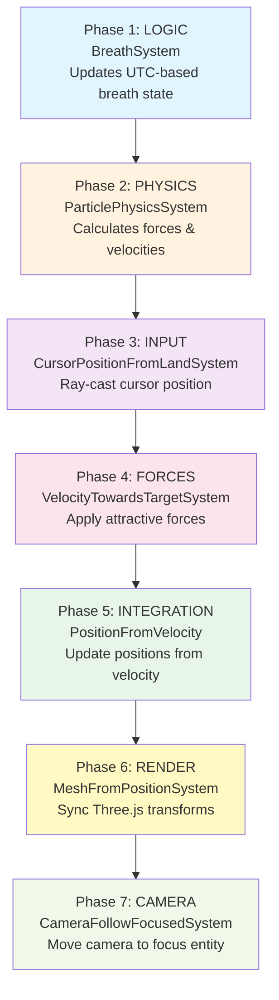
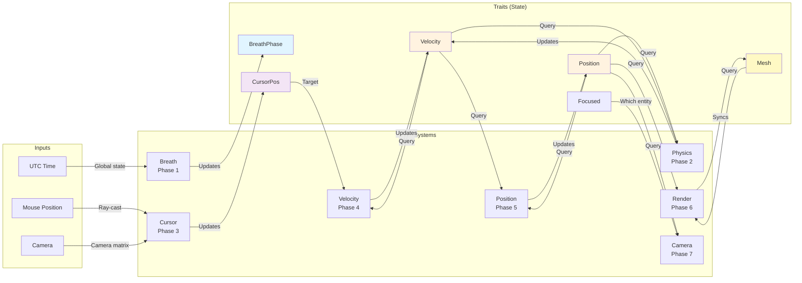

# System Pipeline Architecture

The 7-phase system execution pipeline that drives breathe-together-v2.

## Visual Pipeline



## Phase Description

### Phase 1: Logic

**System**: `breathSystem`
**Input**: UTC time (global, synchronized)
**Output**: breathPhase, orbitRadius, sphereScale, crystallization
**Purpose**: Calculate global breathing state

```typescript
// All users worldwide see the same breathing phase
const phase = (Date.now() % 16000) / 16000  // 0-1 over 16 seconds
const phaseType = Math.floor(phase * 4)     // 0=inhale, 1=hold-in, 2=exhale, 3=hold-out
```

**Key Trait**: `BreathEntity`

---

### Phase 2: Physics

**System**: `particlePhysicsSystem`
**Input**: Position, Velocity, ParticlePhysics traits
**Output**: Updated Velocity (forces applied)
**Purpose**: Apply forces to particles

```
For each particle:
  1. Calculate repulsion from other particles
  2. Apply spring forces toward orbit
  3. Apply damping
  4. Update velocity
```

**Key Traits**: `Position`, `Velocity`, `ParticlePhysics`

---

### Phase 3: Input

**System**: `cursorPositionFromLandSystem`
**Input**: Mouse position, camera, land mesh
**Output**: CursorPosition trait
**Purpose**: Ray-cast from camera through mouse to find cursor world position

```
Ray-casting:
  1. Project mouse coords to 3D ray
  2. Intersect with land geometry
  3. Store intersection point
```

**Key Trait**: `CursorPosition`

---

### Phase 4: Forces

**System**: `velocityTowardsTargetSystem`
**Input**: Position, Velocity, Target traits
**Output**: Updated Velocity (forces toward target)
**Purpose**: Move particles toward cursor

```
For each entity:
  1. Calculate direction to target
  2. Apply attractive force
  3. Add velocity
```

**Key Traits**: `Position`, `Velocity`, `Target`

---

### Phase 5: Integration

**System**: `positionFromVelocitySystem`
**Input**: Position, Velocity traits
**Output**: Updated Position
**Purpose**: Integrate velocity into position

```
For each entity:
  position += velocity * delta
  velocity *= damping  // Natural deceleration
```

**Key Traits**: `Position`, `Velocity`

---

### Phase 6: Render

**System**: `meshFromPositionSystem`
**Input**: Position, Mesh traits
**Output**: Three.js `mesh.position` synced
**Purpose**: Copy ECS Position data to Three.js objects

```
For each entity:
  mesh.position.copy(position)
  mesh.rotation.copy(rotation)
  mesh.scale.copy(scale)
```

**Key Traits**: `Position`, `Mesh`

---

### Phase 7: Camera

**System**: `cameraFollowFocusedSystem`
**Input**: Position traits, Focused entity
**Output**: Camera position updated
**Purpose**: Move camera to follow focused entity

```
Lerp camera toward focused entity:
  camera.position.lerp(focusedEntity.position, 0.1)
```

**Key Traits**: `Position`, `Focused`

---

## Data Dependencies Diagram



---

## Critical Execution Order

Order matters because later systems depend on earlier outputs:

| Phase | System | Why This Order |
|-------|--------|---|
| 1 | Breath | Must run first - sets global state |
| 2 | Physics | Needs Position/Velocity before updating velocity |
| 3 | Cursor | Needs camera state (not dependent on physics) |
| 4 | Velocity | MUST come after Physics (reads updated velocities!) |
| 5 | Position | MUST come after Velocity (reads updated velocities!) |
| 6 | Render | MUST come after Position (syncs to mesh) |
| 7 | Camera | MUST come after Position (follows entity) |

### What Breaks If Order Changes?

```typescript
// ❌ If Physics runs after Velocity:
// Velocity system reads old physics forces
// Physics overwrites velocity updates
// Result: Particles move incorrectly

// ❌ If Render runs before Position:
// Mesh sees old position values
// Visual lag (one frame behind)

// ❌ If Camera runs before Render:
// Camera follows position from previous frame
// Notchy camera movement
```

---

## File Locations

| System | File | Line |
|--------|------|------|
| breathSystem | `src/entities/breath/systems.tsx` | - |
| particlePhysicsSystem | `src/entities/particle/systems.tsx` | - |
| cursorPositionFromLandSystem | `src/entities/cursor/systems.tsx` | - |
| velocityTowardsTargetSystem | `src/shared/systems.tsx` | - |
| positionFromVelocitySystem | `src/shared/systems.tsx` | - |
| meshFromPositionSystem | `src/shared/systems.tsx` | - |
| cameraFollowFocusedSystem | `src/entities/camera/systems.tsx` | - |

Execution order defined in: `src/providers.tsx` → `KootaSystems` component

---

## Profiling the Pipeline

Use Triplex performance metrics:

```
Phase 1 Breath:        0.2ms ✓
Phase 2 Physics:       1.5ms ⚠ (Largest!)
Phase 3 Cursor:        0.1ms ✓
Phase 4 Velocity:      0.3ms ✓
Phase 5 Position:      0.2ms ✓
Phase 6 Render:        8.0ms ⚠ (Syncing to 300 meshes!)
Phase 7 Camera:        0.1ms ✓
---
Total:                11.4ms (90 FPS headroom on 60 FPS target)
```

Optimization opportunities:
- Phase 2 (Physics): Reduce particle count for lower-end devices
- Phase 6 (Render): Uses `setMatrixAt` - already optimized

---

## System Debugging

Disable systems individually to isolate issues:

```typescript
<Canvas>
  <KootaSystems
    breathSystemEnabled={true}       // Disable to freeze breathing
    particlePhysicsEnabled={true}    // Disable to stop particle movement
    cursorEnabled={true}             // Disable to freeze cursor
    velocitySystemEnabled={true}     // Disable to stop velocity updates
    positionSystemEnabled={true}     // Disable to freeze all positions
    renderSystemEnabled={true}       // Disable to see invisible entities
    cameraSystemEnabled={true}       // Disable to freeze camera
  />
</Canvas>
```

---

## Related Resources

- [Koota ECS Patterns](../koota/01-advanced-patterns.md)
- [ECS Data Flow](../ecs-architecture/02-data-flow.md)
- [Next: Adaptive Quality System](./02-adaptive-quality.md)
