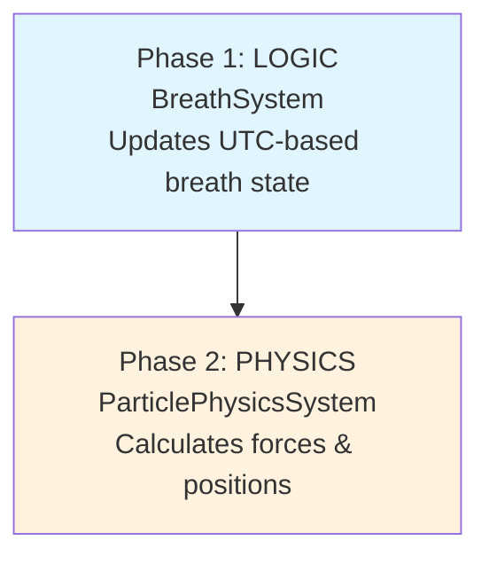

# System Pipeline Architecture

The MVP pipeline is intentionally minimal: two systems, fixed order.

## Visual Pipeline



## Phase Description

### Phase 1: Logic

**System**: `breathSystem`
**Input**: UTC time (global, synchronized)
**Output**: breathPhase, orbitRadius, sphereScale, crystallization
**Purpose**: Calculate global breathing state

```typescript
// All users worldwide see the same breathing phase
const phase = (Date.now() % 16000) / 16000  // 0-1 over 16 seconds
const phaseType = Math.floor(phase * 4)     // 0=inhale, 1=hold-in, 2=exhale, 3=hold-out
```

**Key Trait**: `BreathEntity`

---

### Phase 2: Physics

**System**: `particlePhysicsSystem`
**Input**: Position, Velocity, Acceleration, Mass, restPosition, seed
**Output**: Updated Position + Velocity
**Purpose**: Apply forces and integrate particle motion

```
For each particle:
  1. Spring toward orbit
  2. Wind/turbulence
  3. Jitter during holds
  4. Sphere repulsion
  5. Integrate
```

**Key Traits**: `Position`, `Velocity`, `Acceleration`, `Mass`

---

## MVP Note

Cursor/land/controller input and camera follow systems were removed to keep the
runtime small. Reintroduce only when interaction is required.

---

## Related Resources

- [Next: Adaptive Quality (Deferred)](./02-adaptive-quality.md)
